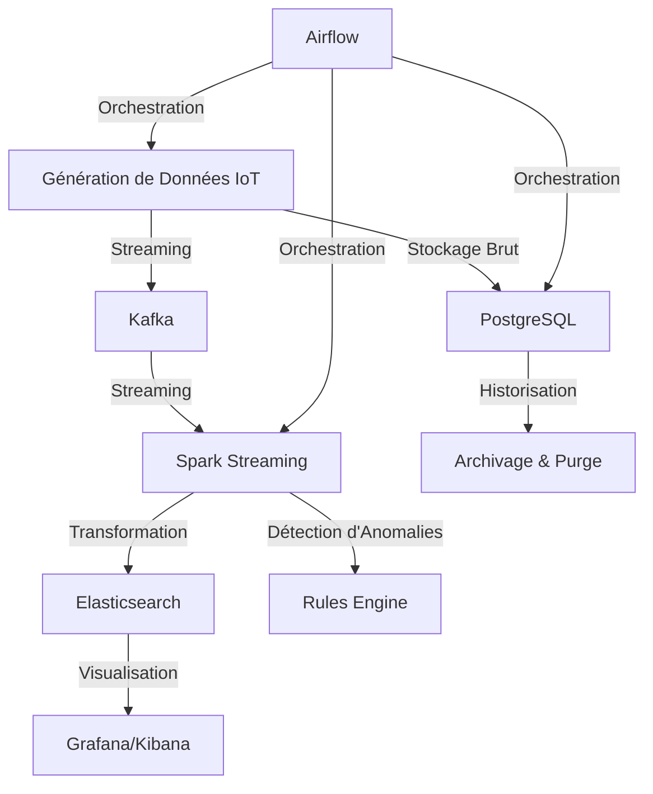

# Agritech IoT Monitoring

## Description
Agritech IoT Monitoring est un projet visant à collecter, transformer et analyser les données provenant de capteurs IoT déployés dans des exploitations agricoles. L'objectif est d'optimiser la gestion agricole en surveillant les conditions environnementales et en détectant les anomalies des machines afin d'anticiper les pannes.

## Architecture du Projet



## Technologies Utilisées
- **Kafka** : Message broker pour le streaming des données IoT.
- **PostgreSQL** : Stockage des données brutes avec une purge automatique.
- **Airflow** : Orchestration des workflows de collecte et transformation.
- **Spark Streaming** : Traitement en temps réel des données et transformation.
- **Elasticsearch** : Indexation et stockage des données transformées.
- **Grafana/Kibana** : Visualisation des indicateurs et anomalies.

## Installation & Déploiement

### Prérequis
- Docker et Docker Compose
- Python 3.x
- Apache Kafka
- PostgreSQL
- Apache Airflow
- Apache Spark
- Elasticsearch, Kibana et Grafana

### Étapes d'Installation
1. **Cloner le projet**
   ```bash
   git clone https://github.com/votre-repo/agritech-iot-monitoring.git
   cd agritech-iot-monitoring
   ```

2. **Lancer les services avec Docker Compose**
   ```bash
   docker-compose up -d
   ```

3. **Vérifier l'état des services**
   ```bash
   docker ps
   ```

## Flux de Données
1. **Génération de données IoT** via un script Python qui simule des capteurs et envoie les données vers Kafka.
2. **Stockage brut dans PostgreSQL** pour conserver une copie des données avant transformation.
3. **Traitement avec Spark Streaming** pour enrichir les données et détecter les anomalies.
4. **Stockage des données transformées** dans Elasticsearch pour analyse.
5. **Visualisation** via Grafana et Kibana pour faciliter l'interprétation des données.
6. **Orchestration avec Airflow** pour automatiser l'ensemble du pipeline.

## Fichiers Importants
- `docker-compose.yml` : Configuration des services.
- `dags/collect_data.py` : DAG Airflow pour la collecte des données.
- `scripts/simulate_iot.py` : Génération de données IoT.
- `spark/transform_data.py` : Transformation des données avec Spark.
- `configs/kafka-config.yml` : Configuration Kafka.
- `notebooks/iot_data_transformmation.ipynb` : Tranformations des données .

## Améliorations Futures
- Intégration de l'IA pour la prédiction des pannes.
- Renforcement des règles métier pour la détection des anomalies.
- Optimisation de la gestion des ressources pour le stockage longue durée.

## Auteurs
### Équipe Data Ing
- **El Hadji MBOUP** - *Project manager*
- **Isabelle OLive Kantoussan** 
- **Abdoulaye Dialllo** 
### Équipe Analytics : 
- **Mouhamed Diagne** 
- **Mouhamed Dieng** 
- **Serigne Saliou Thiam** 

## Licence
Ce projet est sous licence MIT - voir le fichier [LICENSE](LICENSE) pour plus de détails.
